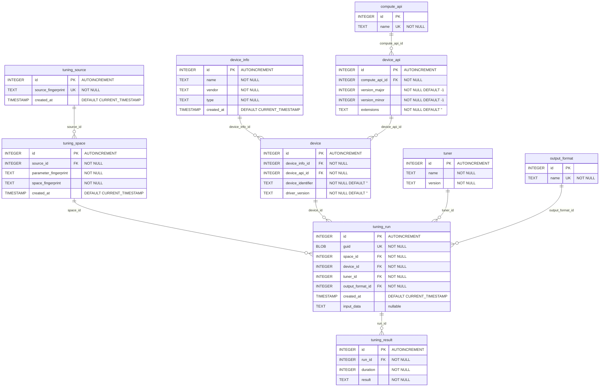

# Database ERD

Entity-relationship diagram of the SQLite schema created by `Schema::CreateIfNotExists`
(see [Database/Schema/Schema.cpp](Database/Schema/Schema.cpp)).

## Notes

- `compute_api` and `output_format` are seeded lookup tables:
  - `compute_api`: `OpenCL` (1), `CUDA` (2), `Vulkan` (3), `Cpp` (4)
  - `output_format`: `JSON` (1), `JSON_T4` (2), `XML` (3)
- Unique constraints (beyond the marked `UK` columns):
  - `device_info` — unique on `(name, vendor, type)`
  - `device_api` — unique on `(compute_api_id, version_major, version_minor, extensions)`
  - `device` — unique on `(device_info_id, device_api_id, device_identifier, driver_version)`
  - `tuner` — unique on `(name, version)`
  - `tuning_space` — unique on `(space_fingerprint, parameter_fingerprint, source_id)`
- `device` is where a run executed: a physical device (`device_info` model + `device_identifier`) running a given
  compute API (`device_api`) and driver version. A new row appears when any of these changes (another card, a driver
  update, …). Typical comparisons, all on the one `device` row a run points to:
  - exact same environment: `tuning_run.device_id = ?`
  - same model: `device.device_info_id = ?`
  - same model, API and driver on any card: `device_info_id`, `device_api_id` and `driver_version` equal
  - same physical card on any driver: `device_info_id` and `device_identifier` equal
- `device.device_identifier` is the persistent hardware identifier of the device (the device UUID reported by the
  compute API, e.g. `GPU-<uuid>` for CUDA), from `ktt::DeviceInfo::GetDeviceIdentifier()` via
  `ktt::db::DeviceInfo::deviceIdentifier`.
- `device.driver_version` comes from `ktt::DeviceInfo::GetDriverVersion()` (NVML for CUDA, `CL_DRIVER_VERSION` for
  OpenCL, `VkPhysicalDeviceDriverProperties::driverInfo` for Vulkan 1.2+).
- No column that is part of a unique index is nullable, because SQLite treats every `NULL` as distinct in unique
  indexes and would let duplicate rows through. Unknown or not applicable values are stored as placeholders and read
  back as unset (`std::nullopt` / empty string) in `ktt::db::DeviceInfo`:
  - `device_api.version_major` / `version_minor`: `-1` for devices without a CUDA compute capability
  - `device_api.extensions`: `''` for devices without extensions (CUDA, C++)
  - `device.device_identifier`: `''` when the compute API does not expose a UUID (e.g. the C++/CPU backend)
  - `device.driver_version`: `''` when unknown or not applicable (e.g. the C++/CPU backend)
- `tuner` records the tuner that produced a run, from `ktt::db::TuningInfo::tuner` (name is always `KTT`, version is
  `ktt::GetKttVersionString()`).
- A `tuning_run` is uniquely identified across databases by its `guid`, which is what
  `SyncFromFile` uses to skip already-imported runs.
- `SyncFromFile` copies each run together with its `device` (including device identifier and driver version) and
  `tuner`.
